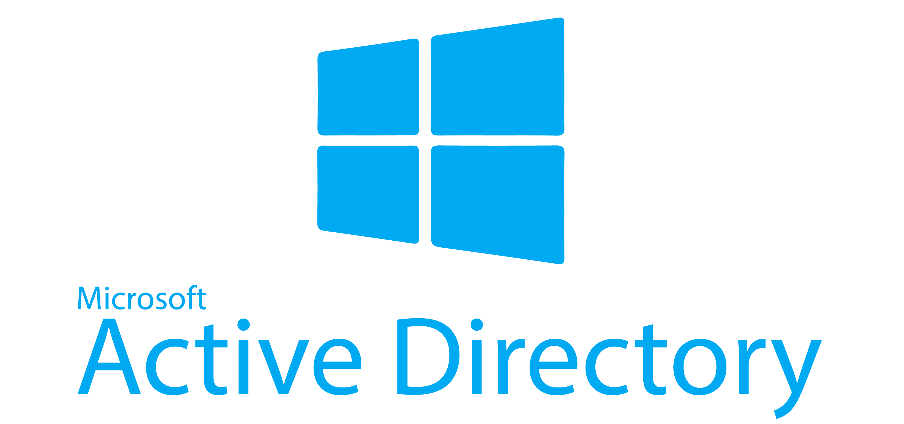
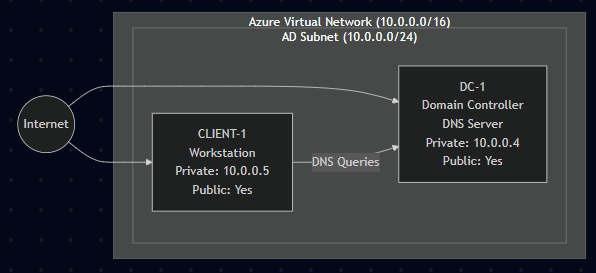
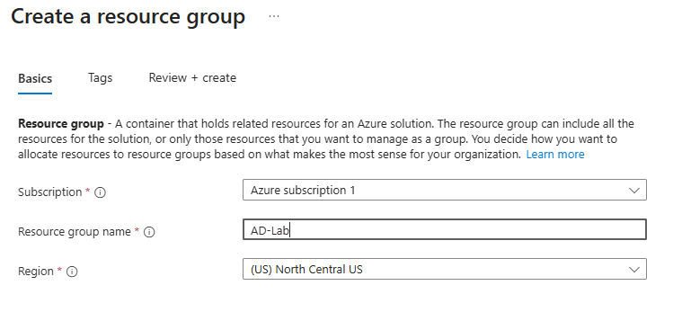
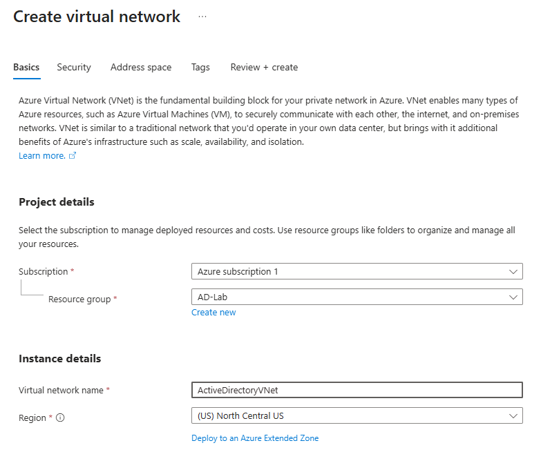
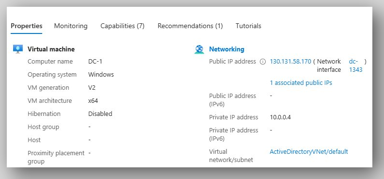
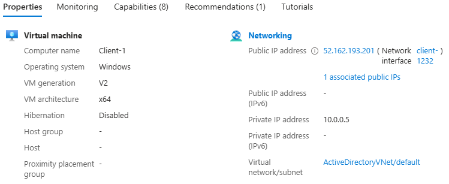
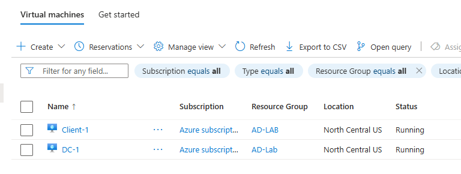

# Environment Setup
This document details the Azure environment provisioned for an Active Directory home lab, including VM configuration, networking, and domain infrastructure.

## Lab Overview
I've built a Windows Server 2022 Domain Controller and a Windows 10 Pro client computer to simulate an enterprise IT environment's identity, access, and network management system

## 🗂️ Lab Architecture





```
Note:  
In a real‑world Azure environment, domain controllers and client VMs should not have public IP addresses.
Instead, organizations use Azure Bastion to securely access VMs without exposing RDP/SSH to the internet.
For lab demonstration purposes, this diagram shows public IPs for simplicity.
```

| Device / Role | Hostname | Private IP | Subnet | DNS Server | Notes |
|---------------|----------|------------|--------|------------|-------|
| Domain Controller / DNS / DHCP | DC-1 | 10.0.0.4 | 10.0.0.0/24 | 10.0.0.4 | Static private IP |
| Client VM 1 | CLIENT-1 | 10.0.0.5 | 10.0.0.0/24 | 10.0.0.4 | DHCP from Azure, domain‑joined |


## Azure Infrastructure
### Resource Group
- **Subscription:** Deafult
- **Resource group name:** AD-Lab
- **Regions:** (US) North Central US




### Virtual Network & Subnet
- **Subscription:** Deafult
- **Resource group:** AD-Lab
- **Virtual Network Name:** ActiveDirectoryVNet
- **Regions:** (US) North Central US




### Domain Controller VM (Windows Server 2019)
- **Image:** Windows Server 2022 Datacenter
- **VM name:** DC-1
- **Static Private IP:** 10.0.0.4
- **Virtual Network:** ActiveDirectoryVNet
- **Location:** (US) North Central US




### Client VM (Windows 10 Pro)
- **Image:** Windows 10 Pro
- **VM name:** Client-1
- **DNS Server:** 10.0.0.4
- **Virtual Network:** ActiveDirectoryVNet
- **Location:** (US) North Central US




## Pre-Configuration Steps
- Put the Domain Controller and client VM on the same virtual network.
- Assign a static private IP address to the Domain Controller virtual machine (10.0.0.4)
- Configured the client virtual machine's DNS server to the Domain Controller's IP address (10.0.0.4)
- Allowed Inbound ports 3389 (RDP) for both VMs


## Environment Validation



