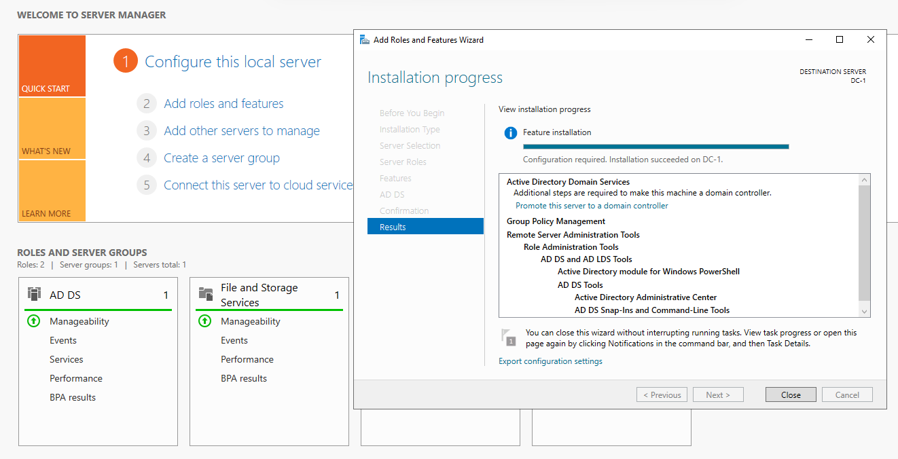
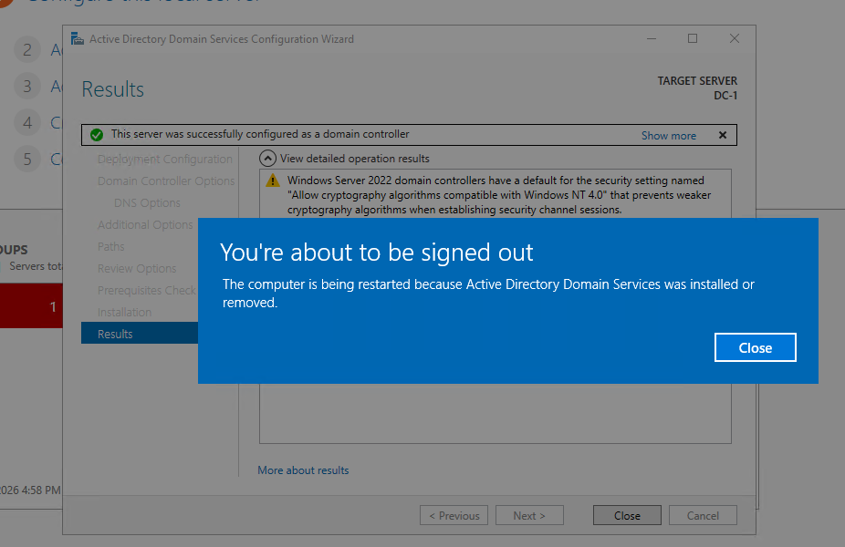
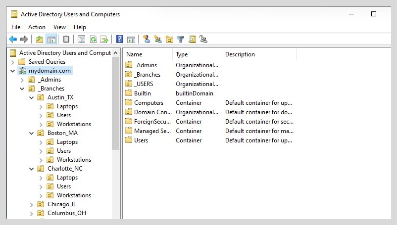
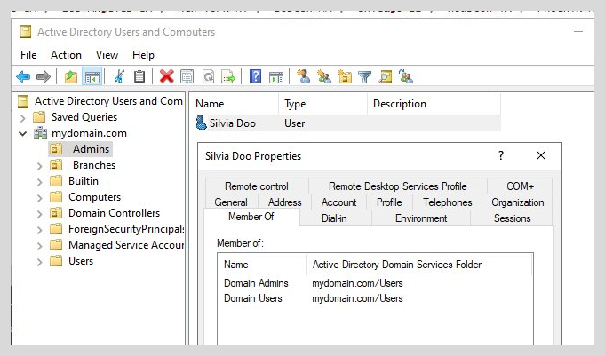
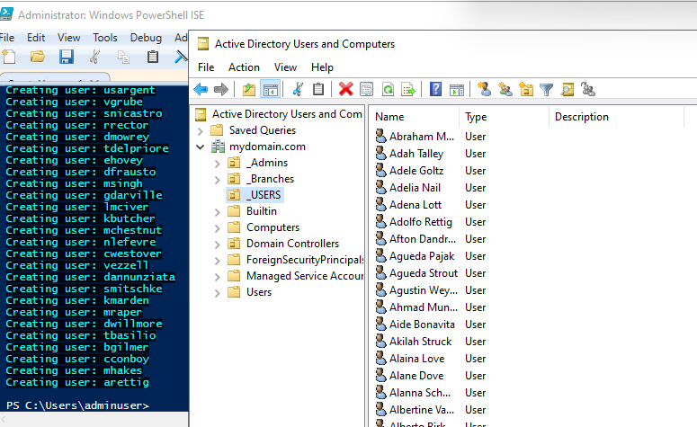
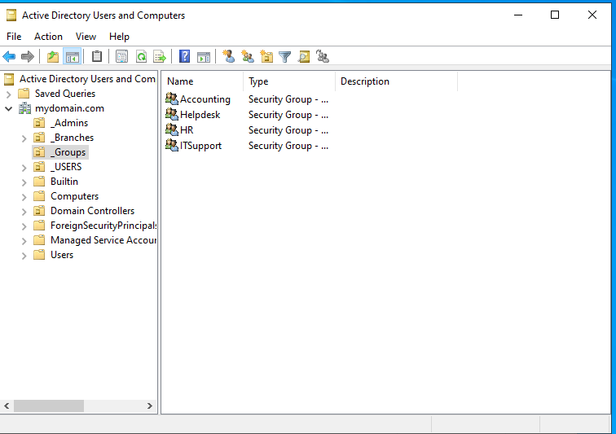
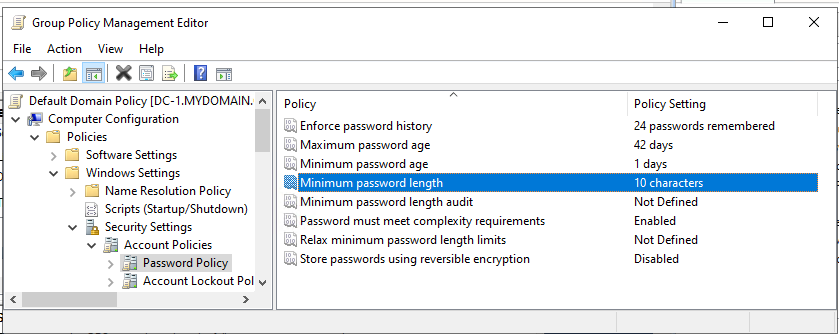
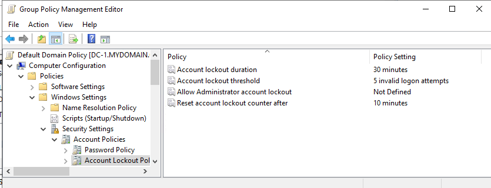
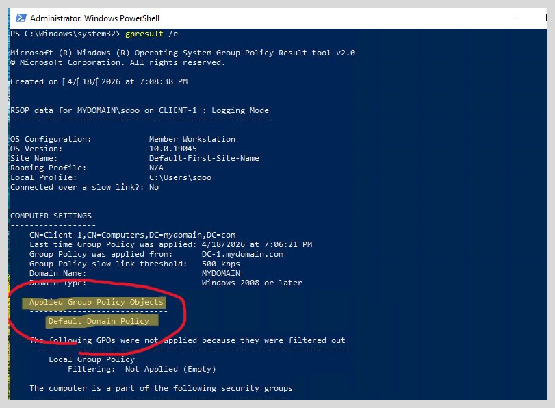

# Active Directory Installation & Configuration

## Overview
This phase covers the installation of Active Directory Domain Services 
on DC-1, domain promotion, and the full configuration of the directory 
structure — including a scalable multi-branch OU design, RBAC-based 
security groups, bulk user provisioning via PowerShell, and domain-wide 
password and lockout policy enforcement through Group Policy.

## AD DS Role Installation
### Role Configuration
- Installed the Active Directory Domain Services (AD DS)




### Domain Promotion
- **Domain Name:** mydomain.com
- **Forest/Domain Functional Level:** Default (because it's already the highest available)
- **DNS:** Configured on DC during promotion



---

## Organizational Unit (OU) Structure

### OU Design Rationale
OUs were designed around **policy boundaries and administrative delegation**, following best practices used in enterprise environments.

    mydomain.com
    ├── _Admins
    │
    ├── _Branches
    │   ├── Houston_TX
    │   │     ├── Users
    │   │     ├── Workstations
    │   │     └── Laptops
    │   └── Las_Vegas_NV
    │         ├── Users
    │         ├── Workstations
    │         └── Laptops
    └── _Groups

| OU Name | Purpose |
|---|---|
| _ADMINS | Privileged admin accounts |
| _Branches | Contains branch locations |
| _Groups | Security groups |
| Workstations | Domain-joined workstations in sub-branch |
| Laptops | Domain-joined laptops in sub-branch |
| Users | Standard user accounts in sub-branch |

This structure allows:

- Targeted Group Policy application
- Clean separation of users and devices
- Scalable expansion to additional locations or departments



### [PowerShell Automation Script](creating_location_OU.ps1)

```PowerShell
$path = "OU=_Branches,DC=mydomain,DC=com"
$sub_ou = "Users", "Workstations", "Laptops"

# here are the 20 most populous cities
$locations = "San_Diego_CA", "Los_Angeles_CA", "New_York_NY", "Boston_MA", "Chicago_IL", "Houston_TX", "Phoenix_AZ", "Philadelphia_PA", "San_Antonio_TX", "Dallas_TX", "Jacksonville_FL", "Fort_Worth_TX", "San_Jose_CA", "Austin_TX", "Charlotte_NC", "Columbus_OH", "Indianapolis_IN", "San_Francisco_CA", "Seattle_WA", "Denver_CO", "Oklahoma_City_OK"


foreach($n in $locations){
    # Creating the location branch
    New-ADOrganizationalUnit -Name $n -ProtectedFromAccidentalDeletion $False -Path $path

    # Creating the sub OUs for the branches aka users, workstations, laptops
    foreach ($ou in $sub_ou) {
        New-ADOrganizationalUnit    -Name $ou `
                                    -ProtectedFromAccidentalDeletion $False `
                                    -Path "OU=$n,$path"
    }
}
```

## User Account Configuration
### Admin Account
- Created a dedicated domain admin account (not using 
  default Administrator)
- **Rationale:** Best practice — mirrors real enterprise 
  security posture



### Standard User Accounts
- Bulk users created via PowerShell script

To practice bulk provisioning, I used [PowerShell Script](creating_users.ps1) to import a name list and create a large test user set in a dedicated lab OU. **A standard lab password was used only for initial testing in this isolated environment.**

```PowerShell
# stores each line to an array of newline-delimited strings
$names = Get-Content -Path .\names.txt
# assign everyone with the same password
$password = ConvertTo-SecureString "Password1" -AsPlainText -Force
# create the OU to store the users
New-ADOrganizationalUnit -Name _USERS -ProtectedFromAccidentalDeletion $false

foreach ($n in $names) {
    # separate first and last name by space delimiter
    $first_name = $n.split(" ")[0].ToLower()
    $last_name = $n.split(" ")[1].ToLower()
    $acc_name = $first_name[0] + $last_name

    Write-Host "Creating user: $acc_name" -BackgroundColor Black -ForegroundColor Cyan

    # create new ADUser
    New-ADUser  -Name $n `
                -GivenName $first_name `
                -Surname $last_name `
                -SamAccountName $acc_name `
                -Path "ou=_USERS,$(([ADSI]`"").distinguishedName)" `
                -AccountPassword $password `
                -Enabled $true
}
```




## Security Groups Design (RBAC)
### Centralized Group Structure

Security groups were stored in a centralized OU to simplify access management.

    _Groups
    ├── Helpdesk
    ├── ITSupport
    ├── HR
    └── Accounting





### Group Membership
- HR -> John Davidson
- Helpdesk -> Alice johnson
- Accounting -> Bob martinez
- ITSupport -> Chris walker

### PowerShell Automation

``` PowerShell
$path = "DC=mydomain,DC=com"
$groupsOU = "OU=_Groups,DC=mydomain,DC=com"

# Creates the _Groups OU first to then add the security groups later
New-ADOrganizationalUnit -Name "_Groups" -ProtectedFromAccidentalDeletion $False -Path $path

# Add new security groups with global scope
New-ADGroup -Name "Helpdesk" -GroupScope Global -GroupCategory Security -Path $groupsOU
New-ADGroup -Name "ITSupport" -GroupScope Global -GroupCategory Security -Path $groupsOU
New-ADGroup -Name "HR" -GroupScope Global -GroupCategory Security -Path $groupsOU
New-ADGroup -Name "Accounting" -GroupScope Global -GroupCategory Security -Path $groupsOU

# Add members to these security groups
Add-ADGroupMember -Identity "Helpdesk" -Members ajohnson
Add-ADGroupMember -Identity "ITSupport" -Members cwalker
Add-ADGroupMember -Identity "HR" -Members jdavidson
Add-ADGroupMember -Identity "Accounting" -Members bmartinez
```

**Why this matters**
- Users almost never get permissions assigned directly. They acquire access through their roles by being placed in a group, and groups are granted access to resources.
- Groups represent job roles
- Permissions are assigned once and scale cleanly


## Group Policy — Password & Account Policy
### Default Domain Policy Configuration

| Setting | Value | Rationale |
|---|---|---|
| Min Password Length | 10 chars | Baseline security standard |
| Password History | 24 | Prevents reuse |
| Account Lockout Threshold | 5 attempts | Brute force mitigation |
| Lockout Duration | 30 minutes | Balance security/helpdesk load |





## Validation
Ran `gpresult /r` on DC-1 to confirm the Default Domain Policy was 
applied and password/lockout settings were enforced at the domain level.



## Key Takeaways
- Users must be placed in the correct OU for targeted GPO application
- Access is granted through group membership, not OU placement — 
  this is the foundation of RBAC 
- Password and lockout policies enforced via GPO apply domain-wide 
  and cannot be bypassed at the user level