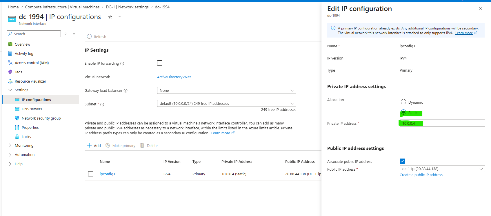
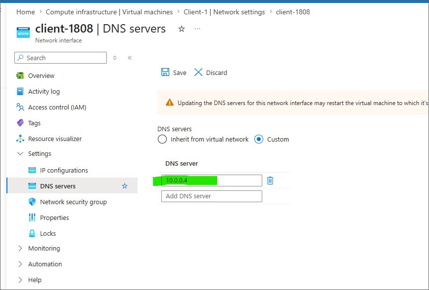
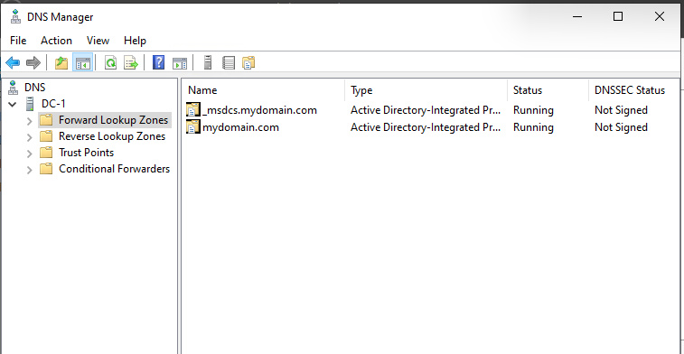
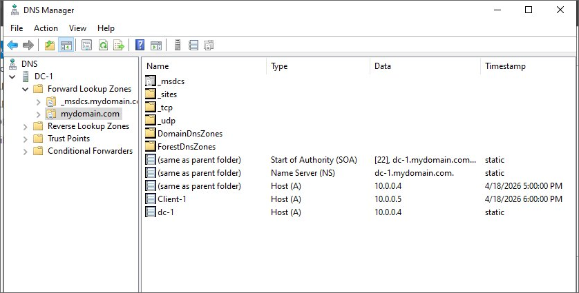
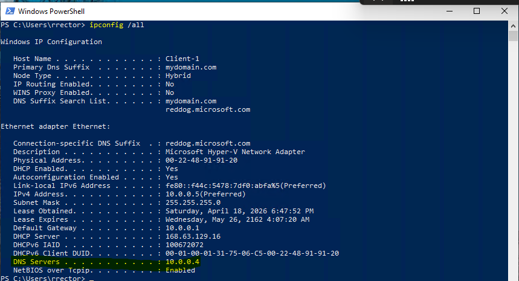
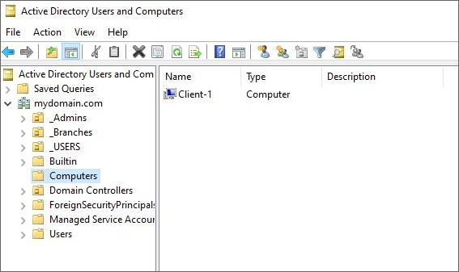
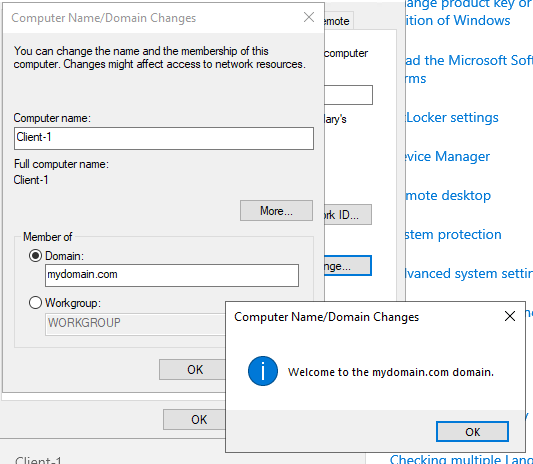
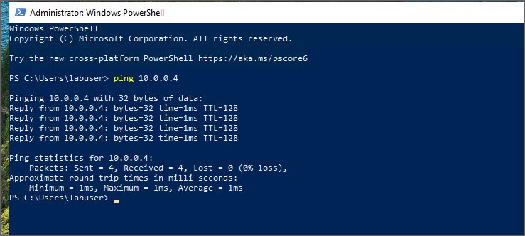
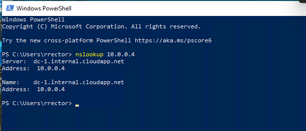

# Networking, DNS 

## Overview
This phase covers the network configuration for the Active Directory lab, including static IP assignment, DNS configuration, forward lookup zones, A records, domain join, and end-to-end connectivity validation.

## Network Architecture

The following address scheme was used across both VMs to ensure 
stable communication and domain functionality throughout the lab.

| Component | Value |
|---|---|
| Virtual Network | 10.0.0.0/16 |
| Subnet | 10.0.0.0/24 |
| DC-1 Static IP | 10.0.0.4 |
| Client-1 IP | 10.0.0.5 (DHCP) |

## Static IP Assignment — Domain Controller
- **Rationale:** DCs must have static IPs — DNS and 
  AD rely on a consistent address
- DC-1's private IP was set to static (10.0.0.4) at the Azure NIC 
  level to ensure the address persists across reboots.

## DNS Configuration
### DC as Primary DNS
- Client VMs configured to point to DC-1 (10.0.0.4) 
  as DNS server
- **Rationale:** Required for domain join and AD 
  authentication to function

### DNS Validation
- Forward lookup zone confirmed for mydomain.com
- Verified A records for DC-1 exist

## Client Domain Join
With DC-1 set as the DNS server, Client-1 was able to locate the domain 
and complete a successful domain join. The machine account was 
automatically created and verified in Active Directory Users and Computers.

- **Domain joined:** mydomain.com  
- **Machine account location:** Computers OU in ADUC  
- **Verification method:** System Properties + ADUC confirmation

`ipconfig /all` confirmed Client-1 received the correct IP address 
and was pointing to DC-1 (10.0.0.4) as its DNS server.

## Connectivity Validation

| Test | Tool | Result |
|---|---|---|
| DC ping from client | ping 10.0.0.4 | Success |
| DNS resolution | nslookup mydomain.com | Resolved |
| Domain join auth | System Properties | Joined |

