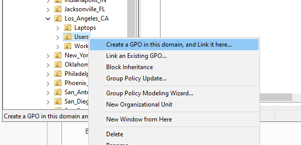
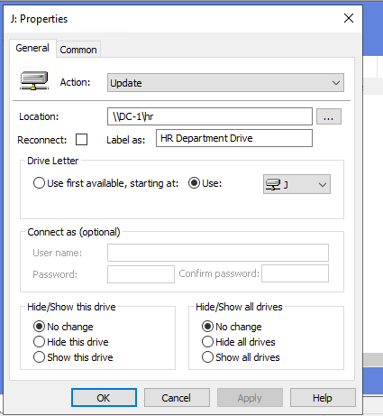
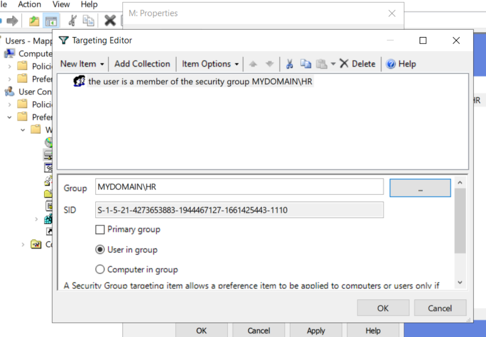
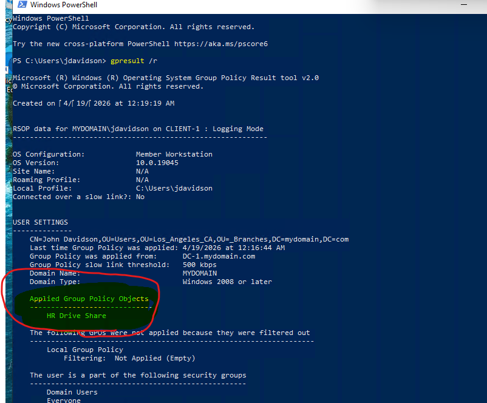

# Real-world Active Directory Tasks

## Overview
This phase covers real-world Active Directory administration tasks 
including drive mapping via logon script and Group Policy Preferences, 
file share security through NTFS and Share permission management, and 
delegated password reset permissions to the Helpdesk group following 
the principle of least privilege.

## Drive Mapping
### Logon Script (SYSVOL)

Created a PowerShell logon script stored in SYSVOL, ensuring availability to all domain users.
  
> **Prerequisites:** The target folder must be created and shared before 
> the script runs. Failure to do this was documented in 
> [Issue #1 of the Troubleshooting file](05-troubleshooting.md).

``` Powershell
$DriveLetter = "H"
$SharePath = "\\DC-1\DeptShare"
$existingDrive = Get-PSDrive -Name $DriveLetter -ErrorAction SilentlyContinue


# Check if drive exists
if (!$existingDrive) {
    New-PSDrive `
        -Name $DriveLetter `
        -PSProvider FileSystem `
        -Root $SharePath `
        -Persist

    Write-Host `
        "Drive $DriveLetter mapped to $SharePath successfully." `
        -ForegroundColor Green
} else {
    Write-Host `
        "Drive $DriveLetter is already mapped to $($existingDrive.Root)" `
        -ForegroundColor Yellow
}

```


### Group Policy Preference
Also implemented drive mapping using Group Policy Preferences to improve reliability and troubleshooting because GPP can be configured to apply drive mappings asynchronously, meaning it'll persist across reboots and it runs after logon. Plus logon scripts are considered legacy. 

Created a new GPO and linked it to the Users in Los_Angeles_CA OU:



Configured the drive mapping with the correct share path and drive letter:



Applied item-level targeting to restrict the mapping to HR security group members only:



Verified GPO application using gpupdate /force and confirmed mapped drive behavior after user logon:



## File Share Security (NTFS vs Share Permissions)

- Share permissions were kept permissive
- NTFS permissions enforced access control

**Why**

- NTFS permissions are granular
- Support inheritance
- Apply locally and over the network
- Align with enterprise security best practices

## Delegated Password Reset Permissions to Helpdesk

Delegated password reset permissions to the Helpdesk group using the Delegation of Control Wizard.


This allows Helpdesk staff to perform common tasks without full administrative rights, following the **principle of least privilege**.

## Future Improvements
- Implement Fine-Grained Password Policies (FGPP)
- Add service accounts with scoped permissions
- Centralize logging and auditing
- Automate user onboarding with CSV-based PowerShell scripts