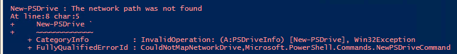
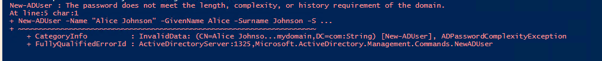

# Troubleshooting & Validation

## Overview
This document captures real issues encountered during the Active Directory 
home lab build. Each entry includes the symptom, investigation process, 
root cause, and resolution — mirroring how issues are documented in 
real IT environments.

---

## Issue #1: Drive Mapping Script Failing — Network Path Not Found

### Symptom
Logon script failed to map the Accounting shared drive. PowerShell returned:



### Investigation
- Attempted to manually navigate to `\\DC-1\Accounting` from the client — path 
  did not resolve
- Opened **File Explorer → Properties** on the Accounting folder on DC-1
- Confirmed the folder existed locally but had **no share configured**

### Root Cause
The folder was created on the Domain Controller but was never shared over 
the network. The script referenced a UNC path (`\\DC-1\Accounting`) that 
did not yet exist as a network share.

### Resolution
1. Right-clicked the Accounting folder → **Properties → Sharing tab**
2. Selected **Share** and added the appropriate security group with 
   correct permissions
   
3. Re-ran the logon script — drive mapped successfully


### Lesson Learned
Always validate the share first before deploying logon scripts prevents failed mappings at login.
Adding a pre-check using Test-Path ensures the script fails with a clear error.
By adding this to the script, if it returns false deployment stops.

```powershell
Test-Path "\\Server\Share"
```

---

## Issue #2: HR User Could See Mapped Drive But Had No Write Access

### Symptom
After mapping a drive to HR users via Group Policy Preferences (GPP) and 
setting NTFS permissions to grant the HR security group Full Control on 
the HR folder, one HR member could see the drive but could not create 
files or folders inside it.


### Investigation
- Doubled checked the HR folder NTFS permissions weren't inherited from the parent folder with `Everyone → Read`
- Confirmed the HR folder NTFS permissions showed HR → Full Control 

- Checked Group policy was applied successfully and HR John Davidson was able to see HR drive

- Realized to check the Share permissions and found `Everyone → Read` only.

### Root Cause
NTFS permissions on the HR folder were correct, but the **Share permissions 
on the HR folder itself** were set to `Everyone → Read`. Share permissions 
and NTFS permissions both apply, and Windows enforces whichever is **more 
restrictive** — in this case, the Share permissions were overriding the 
NTFS Full Control grant.


### Resolution
1. Opened the HR folder → **Properties → Sharing → Advanced Sharing → 
   Permissions**
2. Removed `Everyone → Read`
3. Added `HR Security Group → Full Control` at the Share permission level

4. HR member was then able to create files and folders successfully


### Lesson Learned
Both Share permissions and NTFS permissions must be configured correctly — 
they are not interchangeable. Best practice in enterprise environments is 
to set Share permissions to `Everyone → Full Control` and control access 
exclusively through NTFS permissions to avoid this conflict.

---

## Issue #3: Password complexity + disabled account recovery

### Symptom
Script failed mid-execution during the first New-ADUser call. 
PowerShell returned a password complexity error, halting before 
remaining users were created.



### Script Used
```PowerShell
$path = "DC=mydomain,DC=com"
$groupsOU = "OU=_Groups,DC=mydomain,DC=com"
$ou = "OU=Users,OU=Los_Angeles_CA,OU=_Branches,DC=mydomain,DC=com"

New-ADUser -Name "Alice Johnson" -GivenName Alice -Surname Johnson -SamAccountName ajohnson -Path $ou -AccountPassword (Read-Host -AsSecureString) -Enabled $true

New-ADUser -Name "John Davidson" -GivenName John -Surname Davidson -SamAccountName jdavidson -Path $ou -AccountPassword (Read-Host -AsSecureString) -Enabled $true

New-ADUser -Name "Bob Martinez" -GivenName Bob -Surname Martinez -SamAccountName bmartinez -Path $ou -AccountPassword (Read-Host -AsSecureString) -Enabled $true

New-ADUser -Name "Chris Walker" -GivenName Chris -Surname Walker -SamAccountName cwalker -Path $ou -AccountPassword (Read-Host -AsSecureString) -Enabled $true

```
The script halted, leaving `ajohnson` created in AD but in a 
**disabled state**.


### Investigation
- Error message pointed to an issue in the password requirements so I navigated to **Group Policy Management → Default Domain Policy → 
  Password Policy**
- Reviewed the configured password requirements (minimum length, 
  complexity rules)
- Confirmed the password entered during `Read-Host` prompt did not meet 
  the policy

### Root Cause
The password entered at the prompt was too simple and did not satisfy the 
domain password policy enforced via GPO. The `New-ADUser` cmdlet created 
the account object but could not enable it without a compliant password, 
leaving it disabled.

### Resolution
1. Located `ajohnson` in **Active Directory Users and Computers (ADUC)**
2. Attempted to uncheck **Account is disabled** — failed because no 
   valid password was set
3. Right-clicked account → **Reset Password** → entered a policy-compliant 
   password
4. Unchecked **Account is disabled** → account activated successfully
5. Re-ran the remainder of the script for the remaining users with a 
   compliant password ready

### Lesson Learned
When using `Read-Host -AsSecureString` for password input in scripts, 
validate complexity requirements before running in a domain environment. 
A better practice is to define a compliant default password in the script 
for lab use, or implement a pre-check function that validates against 
the domain policy before account creation.

---

## Final Lab Validation

| Validation Point | Method | Status | Evidence |
|---|---|---|---|
| AD DS role running | Server Manager | ✅ | [Screenshot](screenshots/02-ad-install/adds-running.png) |
| OUs created correctly | ADUC | ✅ | [Screenshot](screenshots/02-ad-install/ouStructure.png) |
| Users created and enabled | ADUC | ✅ | [Screenshot](screenshots/users-enabled.png) |
| Drive mapping working for Accounting | Logon script test | ✅ | [Accounting drive success](screenshots/04-troubleshooting/Screenshot%202026-04-18%20161547.png) |
| Security groups created and populated | ADUC → Group Members | ✅ | [Screenshot](screenshots/02-ad-install/Security_groups.png) |
| GPP drive map visible to HR users | Client login verification | ✅ | [Mapped drive visible](screenshots/04-troubleshooting/HRdrivevisible.png) |
| HR shared drive write access confirmed | File creation test on client | ✅ | [Mapped drive successful](screenshots/04-troubleshooting/Screenshot%202026-04-18%20174732.png) |

## Reflection
This lab reinforced that Windows permission issues are rarely single-layered — 
the Share/NTFS interaction in Issue #2 is a pattern I expect to encounter 
regularly in production environments. The PowerShell errors strengthened my 
understanding of AD account states and GPO enforcement timing as well as best practices for coding. Next iteration 
of this lab will include automating password complexity validation before 
account creation and expanding the GPP drive mapping to additional departments.